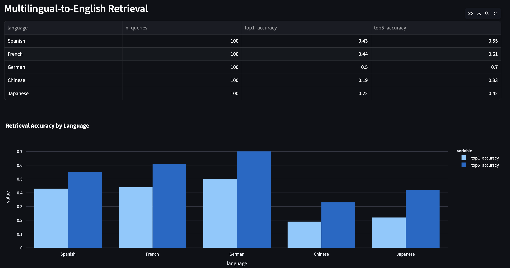
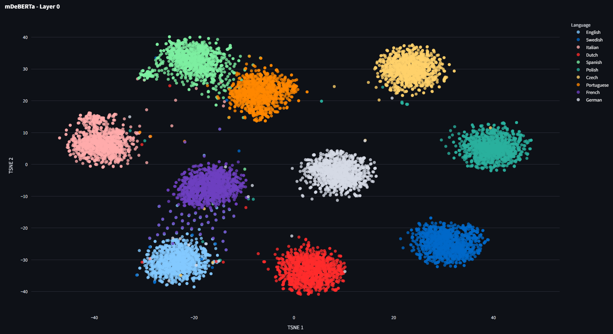
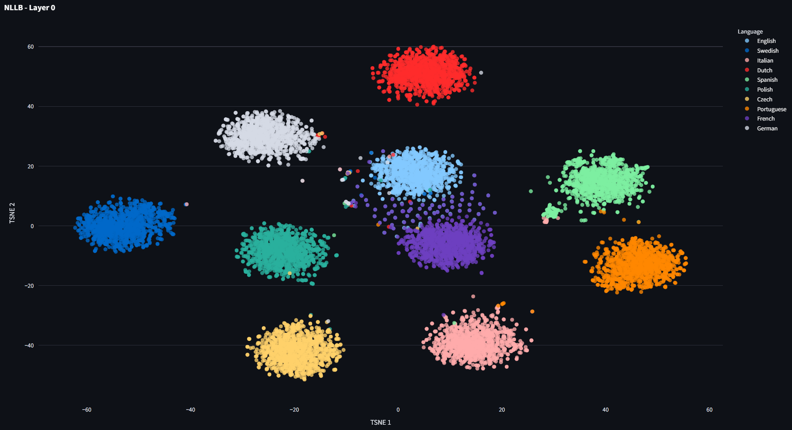
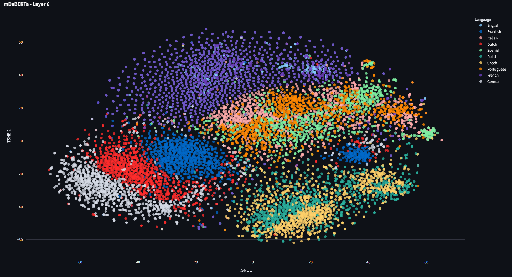
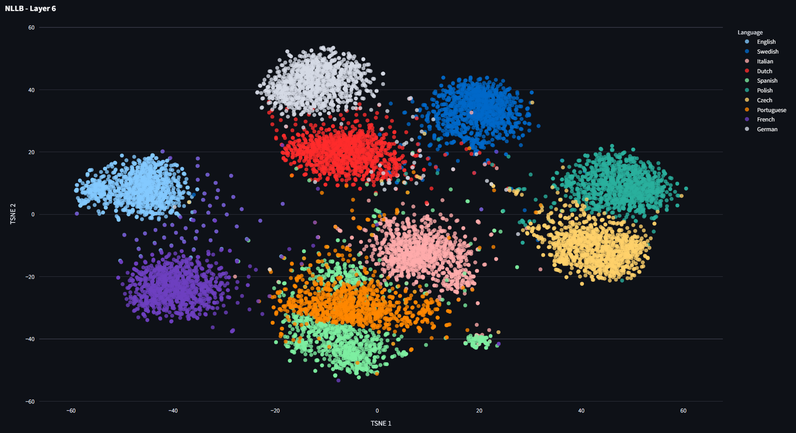
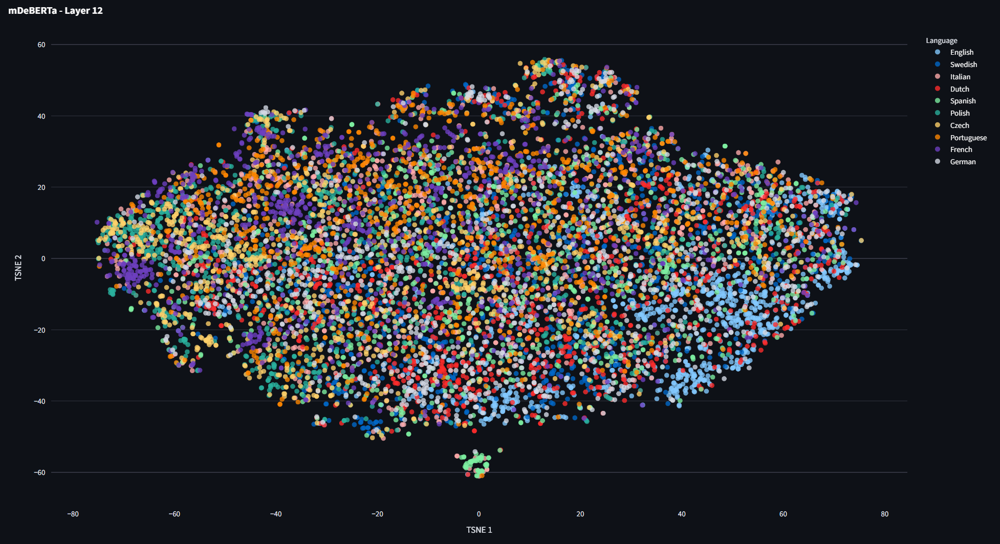
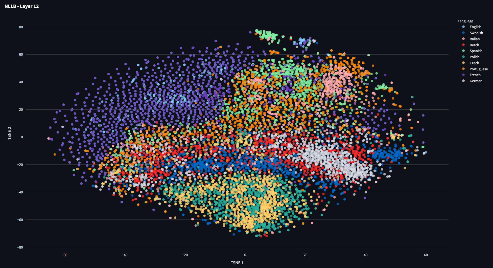

#+STARTUP: latexpreview

* Introduction

:callie: 
The goal of the project was to investigate how different languages are embedded during the process of machine translation. The outcome is a series of experiments and visualizations that provide insight into hows sentences of certain languages and languages as a whole are embedded. Several models were investigated, including NLLB-200 created by a team at meta and the bert model. The resulting project is a streamlit app, which displays experiments involving language embeddings, sentence embeddings, sparse autoencoders, idioms, map visualizations and circle graph visualizations.

* Experiments

** Circle Visulization

:callie: 
The [[file:ui/nllb_circle_visualization.py][circle visualization ui]] aims to allow detailed investigation into specific languages of interest. One langauge at a time can be selected. The visualization is a circle graph displaying a selected number of similar languages. The selected language is displayed as a node at the top of the graph. The width and the color of the edges represent the relative similarity of the connected language.

[[file:project_images/spanish_graph.png][Spanish Graph]]

Above, the Spanish graph can be used to illustrate the UI and some findings from these experiments. In this example, Spanish is the selected language with the ten most similar languages displayed. Here, Galician is the top most similar language. In the interactive UI, the similarity score between Galician and Spanish is 98.72%. Galician is a low resource language spoken in Galicia, which is an autonomous community in Spain. Similarly, Catalan is spoken in Eastern autonomous communities in Spain, as well as some bordering French and Italian communities. Asturian is spoken in  autonomous communities in northern Spain. The similarity score of Asturian in the embeddings is 97.55%.

Featured on the graph, Sardinian is the tenth most similar language with a similarity score of 95%. Portuguese also has a high similarity score with Spanish, 97%.

As an example, this Spanish graph displays languages in the Romance family. In addition, the languages that are similarly embedded are geographically close to Spain as a country. Galician, Catalan, and Asturian are all additional languages spoken within the autonomous communities in Spain. These findings show that in models, the embedding and interpreting of languages is not random. The known linguistic influences for a language, like lanaugage family and geographic location are represented to some extent by the embeddings of the languages in the models.

This visualization specifically displays the language similarity at a single layer for a single model. In this case,  layer 2 is displayed in the NLLB-200 model. NLLB-200 was chosen due to its high number of represented languages. An early layer, layer 2 in this case, was chosen due to the findings of the previous experiments. Previous experiments found that in earlier layers, the embeddings cluster more by language, and later layers cluster more by semantics. This lends itself to the idea that the model must first understand what is being said before processing the meaning.

The next step is to process text from each language. Sentences are embedded from each language represented in the NLLB-200. The token level activations are pooled using max pooling to acquire one feature vector per sentence. Then, for each language, a new feature vector is calculated using the average of each of the sentences. Those feature vectors are created and exported in [[file:sae/export_language_embeddings.py][export_langauge_embeddings.py]].

Finally, [[file:ui/circle_visualization/nllb_geo_chord.py][nllb_geo_chord.py]] computes the cosine distance between each pair of languages. The similarity score is similarity = 1 - normalized_distance.

For a few additional expamples, the graphs for Japanese and English are included.

[[file:project_images/japanese_graph.png][Japanese Graph]]

Japan is highly similar to Simplified Chinese, Korean, and traditional Chinese. The similarity score there is 92%, which is lower than the Spanish language similarity even for the tenth most similar language. This could reflect that the geographic distance is greater. 

[[file:project_images/english_graph.png][English Graph]]

English is actually a bit of an exception in this experiment. The NLLB languages are represented by processed sentences that are part of a machine translation dataset. Each language pair, besides English, is represented by a translation from itself to English. The English dataset is represented as a translation from itself to German, which is notably different.

Some related languages to English are expected, like Esperanto, French and Dutch, however there are also languages that are surprising, such as Asturian and Central Kanuri. Further investigation could be done here. One potential apporach would be to find an English to English (paraphrasing) dataset. Another potential approach would be to investigate the roots of the more unexpected language and consider alternatives, such as global influence or content of the datasets used in NLLB-200. 

** Idioms
:chris:
Idioms have long been a major challenge in Natural Language Processing because their meanings are often non-compositional, meaning the overall phrase cannot be understood directly from the meanings of the individual words. Expressions such as Break a leg or Kick the bucket carry figurative meanings that differ from their literal interpretations, making them difficult for traditional language models and translation systems to interpret correctly. Idioms also vary heavily across cultures and languages, creating additional challenges for tasks such as machine translation, sentiment analysis, and cross-lingual understanding.

Idioms present a unique challenge in understanding how meaning is preserved across languages and cultures. Some idioms may express concepts that are nearly universal, while others are deeply tied to cultural context and therefore difficult to translate directly. This raises an interesting research question: can the “uniqueness” or cross-lingual transferability of an idiom be quantified? By analyzing which idioms maintain semantic similarity across languages and which diverge significantly, it may be possible to gain deeper insight into how meaning is represented and shared between languages. To keep the project within a manageable scope, this study focuses on English idioms and their translations in French, German, Spanish, Chinese, and Japanese.

The first stage of the project involved constructing a [[file:idioms.csv][multilingual idiom dataset]]. A collection of 100 English idioms was compiled and translated into the five target languages: French, German, Spanish, Chinese, and Japanese. Translations were obtained using a combination of Google Translate and online linguistic resources to better preserve idiomatic meaning rather than relying solely on literal word-for-word translations.

The [[file:ui/idioms.py][script]] creates multilingual sentence embeddings using the LASER sentence embedding framework through the LaserEncoderPipeline. For each idiom in the CSV, the English phrase and its translations (Spanish, French, German, Chinese, and Japanese) are encoded into dense vector representations in a shared multilingual embedding space. This means semantically similar idioms across different languages should produce embeddings that are close together, even if the words themselves are completely different. The embeddings are generated using the encode_sentences() function and cached per language to avoid repeatedly loading models.

The CSV was then analyzed using cosine similarity between embeddings to measure semantic alignment between idioms and their translations. The script computes several metrics:

Transferability: the average similarity between the English idiom embedding and all translated idiom embeddings, representing how well the idiomatic meaning transfers across languages.

Divergence: the standard deviation of those similarities, measuring how differently languages preserve the idiom’s meaning.

Consistency: the average pairwise similarity between all non-English translations, showing whether translations across languages remain semantically aligned with each other.

The script also performs a multilingual retrieval evaluation. For each translated idiom, its embedding is compared against embeddings of every English idiom in the dataset. The system ranks the English idioms by cosine similarity and checks whether the correct English idiom appears at rank 1 or within the top 5 results. This produces Top-1 and Top-5 retrieval accuracies, which evaluate how well the embedding space preserves cross-lingual idiomatic meaning.

Finally, the script generates summary CSV files containing:

[[file:idiom_analysis_raw_metrics.csv][raw per-idiom metrics]]

[[file:idiom_analysis_language_summary.csv][average language similarities]]

[[file:idiom_analysis_most_transferable.csv][the most transferable idioms]]

[[file:idiom_analysis_least_transferable.csv][the least transferable idioms]]

and 

When analyzing the average similarity to English, German and French produced the highest similarity scores, with Spanish not far behind. Chinese and Japanese showed lower average similarities of 0.5365 and 0.5028 respectively. These scores can be interpreted as a measure of how semantically aligned the translated idioms were with their English counterparts within the multilingual embedding space. Overall, the results suggest that German and French idioms tend to preserve meanings more similarly to English idioms than those in Chinese or Japanese.

The most transferable idioms included phrases such as “calm before the storm,” “curiosity killed the cat,” and “better late than never,” while the least transferable included “your guess is as good as mine,” “take a rain check,” and “wrap your head around it.” One possible explanation for these differences is the cultural and historical prevalence of certain idioms. Some expressions may have direct equivalents that are commonly used across many languages, while others are more culturally specific or tied to regional expressions, making them more difficult to translate idiomatically.

In the multilingual-to-English retrieval evaluation, German achieved the strongest performance in both Top-1 and Top-5 retrieval accuracy. French and Spanish also performed well, while Japanese surprisingly outperformed Chinese despite having a lower average similarity score. Similar to the similarity analysis, these retrieval results indicate that German, French, and Spanish idioms more closely align with English idiomatic meaning than Chinese or Japanese. In this context, the German embeddings appeared to preserve cross-lingual idiomatic meaning most effectively, with French and Spanish showing comparable performance.

Broadly, these findings align with linguistic expectations. English, German, French, and Spanish all belong to the [[https://en.wikipedia.org/wiki/Indo-European_languages][Indo-European language]] family, with English and German sharing particularly strong Germanic roots. In contrast, Chinese and Japanese are genetically unrelated to the Indo-European languages and differ significantly in syntax, writing systems, and cultural expression. These structural and cultural differences may help explain why English idioms transfer less effectively into Chinese and Japanese.

** Globe Translation Graph
:dane:

Despite our world having over 7,000 actively spoken currently in the world, many languages share quite a few things in common. Many languages have similar conceptual ideas, but have different ways of portraying that. Some lanuages portray and communicate those shared concepts much more similarly than other languages. This globe graph demonstrates and shows how similar different languages are when it comes to a set of core conceptual concepts.

In the graph, each node has a language code, a display name, a language family, and a latitude and longitude value. These attributes can be found in [[file:DANE-globe_graph/GlobeGraphTranslation/graph_data.json.csv][Globe Graph Data]]

In the graph, you will see that each of these nodes has multiple lines connecting to it. Each of these lines connect one language to another language that is close to it in the precomputed embedding distance matrix. Originally, the overall distance between languages was computed (a smaller distance meaning more similar languages). This distance is used in [[file:DANE-globe_graph/GlobeGraphTranslation/generate_globe_graph.py][Generate Globe Graph]]. We use the embedding distances to display a higher opacity connection for stronger connected languages while displaying a lighter line for less connected languages.

This graph has multiple UI filtering options. One of them is an option to filter via top-k nearest neighbors. This shows each language's top-ranked closest languages. Another filtering option is mutual nearest neighbors, which basically only shows language pairs where both languages consider each other highly similar.

Other filtering options include a language family filter, a top-k slider, and a minimum similarity slider. All in all, these filters help you visualize and filter what kinds of languages and relationships you would like to see.

This interface allows users to filter relationships by nearest-neighbor strength, language family, same-family versus cross-family links, mutual nearest-neighbor relationships, and minimum similarity threshold. This allows the user to explore both expected genealogical clusters and unexpectd cross-family similarities in the learned language representation space.

** Sparse Autoencoders
:trevor:
Language model features are notoriously hard to interpret; individual neurons in a transformer model's multi-layer preceptron (MLP) layers may attend to many diverse concepts, the relation of which may not be easily reasoned about. To directly reason about a language model's concept space, we employ sparse autoencoders (SAEs).

SAEs are wide, shallow MLP with an encoder and a decoder layer, whose feature dimensions are typically set to some integer multiple of the feature dimension within the language model in question.

In our experiments, we investigated two [[file:./sae/sae.py][SAE architectures]]:
  - The standard sparse autoencoder, which is trained with loss 
$$\|x-\hat x\|^2_2+\|z\|_1$$

$x$ being the input feature vector from the LM layer under study, and $z$ being the feature vector output of the SAE encoder. The second term helps to encourage sparsity.

  - The gated SAE architecture, which adds a thresholding and scaling step in order to more discretely keep only active features and estimate their magnitudes. It requires an additional loss term which is computed from a reconstructed $x$ using a frozen copy of the decoder and the non-thresholded feature path 
$$\|x-\hat x_{f} \|_2^2$$

We trained SAEs for several different multi-lingual LMs, with the intent of investigating language model feature spaces across different languages for models which were deliberately trained on balanced language data.

Each trained SAE has a corresponding config describing hyperparameter settings for [[file:./sae/train.py][training]]:
  - We displayed results for several SAEs trained from NLLB-600m:

    - [[file:./sae/configs/nllb/larger_l1_latent.json][Our standard settings]]

    - [[file:./sae/configs/nllb/8k_feats.json][Larger latent dimension]]

    - [[file:./sae/configs/nllb/high_sparsity.json][Higher sparsity coeficient]]

  - mDeBERTa-v3-base:

    - [[file:./sae/configs/big_latent_mdeberta.json][Standard]]

    - [[file:./sae/configs/mdeberta/high_sparsity.json][Higher sparsity]]

  - mmBERT-base:

    - [[file:./sae/configs/mmbert/big_latent_mmbert.json][Standard]]

Once trained, we [[file:./sae/precompute_embeddings.py][computed embeddings]] for 1000 sentences from the FLORES-200 dataset.

In order to [[file:./ui/sparse_autoencoders.py][visualize]] these embeddings in a 2D space, we took the feature vector for each sentence's top-activating token position as a representation of the sentence, and projected the resulting matrix down to 2D via umap $S, F \rightarrow S, 2$

Additionally, we projected the transposed matrix down to 2D to recover a per-feature 2D representation, $F, S \rightarrow F, 2$

Apart from the visual analysis, we also provide a [[file:./sae/analyze.py][script]] which, when provided with the training config for the trained SAE to analyze, computes feature representations and prints out the top activating features and their top activating sentences.

Upon inspection, we see that these sparse autoencoders are learning feature representations which activate strongly with regard to related concepts which we can easily reason about; some common examples across different LMs include features for attending to specific countries or continents (i.e. a Europe feature which activates on mentions of the EU and of Europe, and on the word european in different languages), and features for attending to the concept of academia (including a feature which activates strongly on the word University, and a feature which activates strongly on the word professor)

While these features occupy a space without obvious clusters for the most part, related features are still distributed with regards to spatial distances; the university features all lie close together in 2D space, and the country features also lie close together. The country features also border features attending to political concepts, and the feature which attends to the concept of war in the standard NLLB-600m case.

Additionally, viewing the 2D sentence projections reveals strong clusters with regard to semantic meaning; senteces often form tight clusters with their direct translations, and these clusters lie close to other sentences dealing with similar subject matter.

** Language Embeddings
:logan:

To assess how multilingual large language models (MLLMs) capture relationships between languages within their internal representations, we [[file:ui/language_embeddings.py][visualized 2D projections of sentence embeddings]] from several languages across multiple model layers. In our experiments, we captured sentence embeddings from two pretrained MLLMs: an encoder-decoder mDeBERTa-v3 model and an encoder-only NLLB-200 model. Speifically, we extracted embeddings from 12 consecutive layers for both models, corresponding to 6 encoder layers and 6 decoder layers for the mDeBERTa model, and 12 encoder layers for the NLLB-200 model. 

To compute a model's embedding for a given sentence, we first pass the sentence through the model and extract its per-token embeddings at a specified layer. We then average pool the token embeddings into a single sentence embedding, excluding special tokens (e.g., padding or CLS tokens). For our visualizations, we first obtained 1000 sentence embeddings at each model layer for the 10 languages being evaluated (English, Swedish, Italian, Dutch, Spanish, Polish, Czech, Portuguese, French, and German). We then produced 2D t-SNE projections for each layer, coloring points based on their source language.

Both the mDeBERTa and NLLB models separate language embeddings very well at the first layer, with all sentence embeddings nicely clustering by language. The only slight exceptions are the English and French embeddings, which show some overlap due to the fact they use the same sentence pairs. This suggests that the MLLMs form an initial language-specific representation of the text before further processing, orienting the model before forming higher level semantic representations.

By the sixth layer, both models begin to mix embeddings as they incorporate additional semantic context. mDeBERTa particularly begins blending embeddings at this stage, forming high-level representations of the text before transitioning to decoding. Similar languages begin to cluster together, such as Spanish and Portuguese or Dutch and German. It appears that the models begin to form higher level representations of languages at these middle layers, positioning related languages closely together in feature space.

At the deepest layer, mDeBERTa embeddings appear to be completely blended together, as the model has fully incorporated both language-specific features and high-level semantic content. As a result, even the French-English embeddings become fully separated, despite originating from the same sentence pairs. On the other hand, NLLB embeddings remain somewhat grouped by language, with related pairs such as Spanish and Portuguese or Czech and Polish still clustering within the same regions. We find that the last-layer NLLB embeddings project similarly to the mid-layer mDeBERTa embeddings, suggesting that the encoder-only NLLB model forms similar latent representations of multilingual sentences as the mDeBERTa encoder, despite their architectural differences.

* Conclusions

:callie: 
From the circle visualization, one conclusion is that NLLB-200 the known linguistic influences for a language, like language family and geographic location are represented to some extent by the embeddings of the languages in the models. Although the inner workings of neural net models are largely a black box, it is interesting to consider that its embedding and interpreting of information is not entirely dissimilar to our own. 

:chris:
 The idiom analysis showed that through laser embeddings, insightful cross-lingual relationships were uncovered. The results showed that  while idioms are unique due to the evolution of language and societal influences, traces of common human experiences are present in each language. Particularly, similarities in Indo-European languages are strong compared to English. While the Chinese and Japanese idioms are not as closely similar to English idioms, certain idioms transcend languages and are well-expressed cross-lingually.  

:dane:
 From the globe graph visualization, we can see relationships between local and more regional languages, but also languages that might be unexpectantly related. We can easily filter through different language families and see the strenght of the similarities between different languages. All of these features help the user better understand and visualize the correlations and connections between different languages.

:trevor:
From the feature representations we were able to build using sparse autoencoders, we can strongly motivate that multi-lingual language models learn internal feature representations which are less biased to a single language than those of a LLM trained on primarily English, such as the LLama line of models. These sparse-autoencoders are able to recover features for language agnostic concepts, which often activate strongest on non-English examples. Additionally, we show that the feature space recovered by these SAEs clusters with regard to meaning before language; particularly in the case of NLLB-600m, sentences form tight clusters with their direct translations, and with sentences which deal with related concepts, while the 2D feature representations lie spatially closer to features which activate strongly on related concepts. These models are building latent spaces in which semantic meaning corresponds to mathematical similarity.

:logan:
The 2D sentence embedding projections provide a qualitative visualization of how multilingual sentences are processed throughout MLLMs. For both models tested, we found that languages are cleanly separable at early layers, suggesting that MLLMs possess a discriminative low-level understanding of a variety of languages, even closely related pairs like Spanish and Portuguese. In addition, we found that the models appear to incorporate more of the language-agnostic content of the text at deeper layers, blending language embeddings together as the layers shift from encoding to decoding.