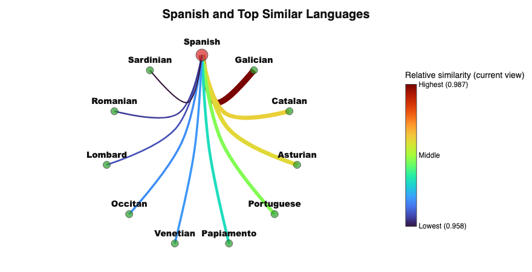
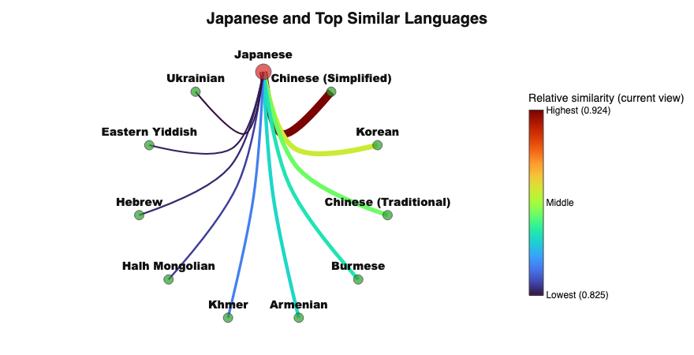
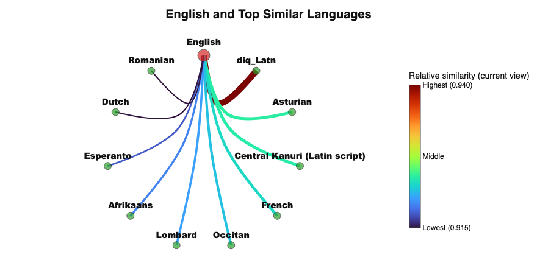

* Introduction

:callie: 
The goal of the project was to investigate how different languages are embedded during the process of machine translation. The outcome is a series of experiments and visualizations that provide insight into hows sentences of certain languages and languages as a whole are embedded. Several models were investigated, including NLLB-200 created by a team at meta and the bert model. The resulting project is a streamlit app, which displays experiments involving language embeddings, sentence embeddings, sparse autoencoders, idioms, map visualizations and circle graph visualizations.

* Experiments

** Circle Visulization

:callie: 
The [[file:ui/nllb_circle_visualization.py][circle visualization ui]] aims to allow detailed investigation into specific languages of interest. One langauge at a time can be selected. The visualization is a circle graph displaying a selected number of similar languages. The selected language is displayed as a node at the top of the graph. The width and the color of the edges represent the relative similarity of the connected language.

Above, the Spanish graph can be used to illustrate the UI and some findings from these experiments. In this example, Spanish is the selected language with the ten most similar languages displayed. Here, Galician is the top most similar language. In the interactive UI, the similarity score between Galician and Spanish is 98.72%. Galician is a low resource language spoken in Galicia, which is an autonomous community in Spain. Similarly, Catalan is spoken in Eastern autonomous communities in Spain, as well as some bordering French and Italian communities. Asturian is spoken in  autonomous communities in northern Spain. The similarity score of Asturian in the embeddings is 97.55%.

Featured on the graph, Sardinian is the tenth most similar language with a similarity score of 95%. Portuguese also has a high similarity score with Spanish, 97%.

As an example, this Spanish graph displays languages in the Romance family. In addition, the languages that are similarly embedded are geographically close to Spain as a country. Galician, Catalan, and Asturian are all additional languages spoken within the autonomous communities in Spain. These findings show that in models, the embedding and interpreting of languages is not random. The known linguistic influences for a language, like lanaugage family and geographic location are represented to some extent by the embeddings of the languages in the models.

This visualization specifically displays the language similarity at a single layer for a single model. In this case,  layer 2 is displayed in the NLLB-200 model. NLLB-200 was chosen due to its high number of represented languages. An early layer, layer 2 in this case, was chosen due to the findings of the previous experiments. Previous experiments found that in earlier layers, the embeddings cluster more by language, and later layers cluster more by semantics. This lends itself to the idea that the model must first understand what is being said before processing the meaning.

The next step is to process text from each language. Sentences are embedded from each language represented in the NLLB-200. The token level activations are pooled using max pooling to acquire one feature vector per sentence. Then, for each language, a new feature vector is calculated using the average of each of the sentences. Those feature vectors are created and exported in [[file:sae/export_language_embeddings.py][export_langauge_embeddings.py]].

Finally, [[file:ui/circle_visualization/nllb_geo_chord.py][nllb_geo_chord.py]] computes the cosine distance between each pair of languages. The similarity score is similarity = 1 - normalized_distance.

For a few additional expamples, the graphs for Japanese and English are included.

Japan is highly similar to Simplified Chinese, Korean, and traditional Chinese. The similarity score there is 92%, which is lower than the Spanish language similarity even for the tenth most similar language. This could reflect that the geographic distance is greater. 

English is actually a bit of an exception in this experiment. The NLLB languages are represented by processed sentences that are part of a machine translation dataset. Each language pair, besides English, is represented by a translation from itself to English. The English dataset is represented as a translation from itself to German, which is notably different.

Some related languages to English are expected, like Esperanto, French and Dutch, however there are also languages that are surprising, such as Asturian and Central Kanuri. Further investigation could be done here. One potential apporach would be to find an English to English (paraphrasing) dataset. Another potential approach would be to investigate the roots of the more unexpected language and consider alternatives, such as global influence or content of the datasets used in NLLB-200. 

** Idioms
Idioms have long been a major challenge in Natural Language Processing because their meanings are often non-compositional, meaning the overall phrase cannot be understood directly from the meanings of the individual words. Expressions such as Break a leg or Kick the bucket carry figurative meanings that differ from their literal interpretations, making them difficult for traditional language models and translation systems to interpret correctly. Idioms also vary heavily across cultures and languages, creating additional challenges for tasks such as machine translation, sentiment analysis, and cross-lingual understanding.

Idioms present a unique challenge in understanding how meaning is preserved across languages and cultures. Some idioms may express concepts that are nearly universal, while others are deeply tied to cultural context and therefore difficult to translate directly. This raises an interesting research question: can the “uniqueness” or cross-lingual transferability of an idiom be quantified? By analyzing which idioms maintain semantic similarity across languages and which diverge significantly, it may be possible to gain deeper insight into how meaning is represented and shared between languages. To keep the project within a manageable scope, this study focuses on English idioms and their translations in French, German, Spanish, Chinese, and Japanese.

The first stage of the project involved constructing a multilingual idiom dataset. A collection of 100 English idioms was compiled and translated into the five target languages: French, German, Spanish, Chinese, and Japanese. Translations were obtained using a combination of Google Translate and online linguistic resources to better preserve idiomatic meaning rather than relying solely on literal word-for-word translations.

The script creates multilingual sentence embeddings using the LASER sentence embedding framework through the LaserEncoderPipeline. For each idiom in the CSV, the English phrase and its translations (Spanish, French, German, Chinese, and Japanese) are encoded into dense vector representations in a shared multilingual embedding space. This means semantically similar idioms across different languages should produce embeddings that are close together, even if the words themselves are completely different. The embeddings are generated using the encode_sentences() function and cached per language to avoid repeatedly loading models.

The CSV was then analyzed using cosine similarity between embeddings to measure semantic alignment between idioms and their translations. The script computes several metrics:

Transferability: the average similarity between the English idiom embedding and all translated idiom embeddings, representing how well the idiomatic meaning transfers across languages.
Divergence: the standard deviation of those similarities, measuring how differently languages preserve the idiom’s meaning.
Consistency: the average pairwise similarity between all non-English translations, showing whether translations across languages remain semantically aligned with each other.
The script also performs a multilingual retrieval evaluation. For each translated idiom, its embedding is compared against embeddings of every English idiom in the dataset. The system ranks the English idioms by cosine similarity and checks whether the correct English idiom appears at rank 1 or within the top 5 results. This produces Top-1 and Top-5 retrieval accuracies, which evaluate how well the embedding space preserves cross-lingual idiomatic meaning.

Finally, the script generates summary CSV files containing:
[[file:idioms_analysis_raw_metrics.csv][raw per-idiom metrics]]
[[file:idiom_analysis_language_summary.csv][average language similarities]]
[[file:idiom_analysis_most_transferable.csv][the most transferable idioms]]
[[file:idiom_analysis_least_transferable.csv][the least transferable idioms]]
and optional retrieval evaluation results.

When analyzing the average similarity to English, German and French produced the highest similarity scores, with Spanish not far behind. Chinese and Japanese showed lower average similarities of 0.5365 and 0.5028 respectively. These scores can be interpreted as a measure of how semantically aligned the translated idioms were with their English counterparts within the multilingual embedding space. Overall, the results suggest that German and French idioms tend to preserve meanings more similarly to English idioms than those in Chinese or Japanese.

The most transferable idioms included phrases such as “calm before the storm,” “curiosity killed the cat,” and “better late than never,” while the least transferable included “your guess is as good as mine,” “take a rain check,” and “wrap your head around it.” One possible explanation for these differences is the cultural and historical prevalence of certain idioms. Some expressions may have direct equivalents that are commonly used across many languages, while others are more culturally specific or tied to regional expressions, making them more difficult to translate idiomatically.

In the multilingual-to-English retrieval evaluation, German achieved the strongest performance in both Top-1 and Top-5 retrieval accuracy. French and Spanish also performed well, while Japanese surprisingly outperformed Chinese despite having a lower average similarity score. Similar to the similarity analysis, these retrieval results indicate that German, French, and Spanish idioms more closely align with English idiomatic meaning than Chinese or Japanese. In this context, the German embeddings appeared to preserve cross-lingual idiomatic meaning most effectively, with French and Spanish showing comparable performance.

Broadly, these findings align with linguistic expectations. English, German, French, and Spanish all belong to the Indo-European language family, with English and German sharing particularly strong Germanic roots. In contrast, Chinese and Japanese are genetically unrelated to the Indo-European languages and differ significantly in syntax, writing systems, and cultural expression. These structural and cultural differences may help explain why English idioms transfer less effectively into Chinese and Japanese.

* Conclusions

:callie: 
From the circle visualization, one conclusion is that NLLB-200 the known linguistic influences for a language, like lanaugage family and geographic location are represented to some extent by the embeddings of the languages in the models. Although the inner workings of neural net models are largely a black box, it is interesting to consider that its embedding and interpreting of information is not entirely dissimilar to our own.  
